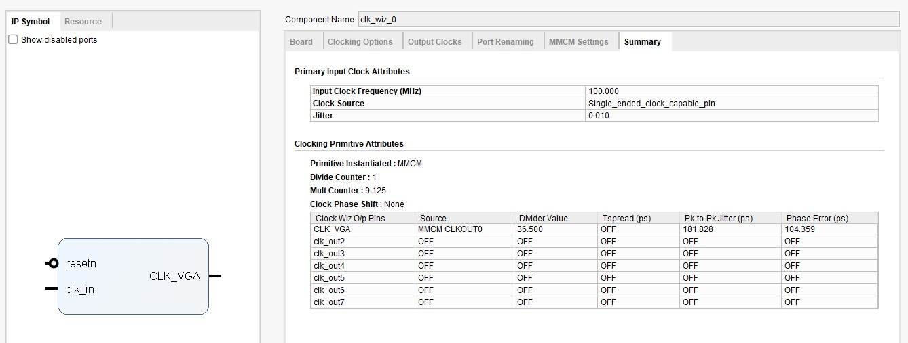

   
&nbsp; 

<h2 class="c32 c33" id="h.gjdgxs"></h2>

<h2 class="c34 title" id="h.30j0zll">Driving a VGA and keyboard with Nexys 4 DDR FPGA BOARD</h2>

---

Luca Caronti, Simone Ruffini

University of Trento

Supervisor: Prof. Roberto Passerone

---

<a class="c2" href="#h.w4lxkigjksng">Overview</a>&nbsp;&nbsp;&nbsp;&nbsp;&nbsp;&nbsp;&nbsp;&nbsp;

<a class="c2" href="#h.1us46n6g1bzt">Project specifics</a>&nbsp;&nbsp;&nbsp;&nbsp;&nbsp;&nbsp;&nbsp;&nbsp;

<a class="c2" href="#h.8q64rxri1pn9">Architecture specification</a>&nbsp;&nbsp;&nbsp;&nbsp;&nbsp;&nbsp;&nbsp;&nbsp;

<a class="c2" href="#h.w0ko7nd2nj93">Top level project</a>&nbsp;&nbsp;&nbsp;&nbsp;&nbsp;&nbsp;&nbsp;&nbsp;

<a class="c2" href="#h.lrzz86ui9ttb">Image generator</a>&nbsp;&nbsp;&nbsp;&nbsp;&nbsp;&nbsp;&nbsp;&nbsp;

<a class="c2" href="#h.by5b8vlkwiey">General description</a>&nbsp;&nbsp;&nbsp;&nbsp;&nbsp;&nbsp;&nbsp;&nbsp;

<a class="c2" href="#h.iml7vh2vamjo">Port Description</a>&nbsp;&nbsp;&nbsp;&nbsp;&nbsp;&nbsp;&nbsp;&nbsp;

<a class="c2" href="#h.h7se9owqbrfb">Processes</a>&nbsp;&nbsp;&nbsp;&nbsp;&nbsp;&nbsp;&nbsp;&nbsp;

<a class="c2" href="#h.x29x8o50avjl">Combinational logic</a>&nbsp;&nbsp;&nbsp;&nbsp;&nbsp;&nbsp;&nbsp;&nbsp;

<a class="c2" href="#h.36myif3jkmfo">Frame buffer</a>&nbsp;&nbsp;&nbsp;&nbsp;&nbsp;&nbsp;&nbsp;&nbsp;

<a class="c2" href="#h.7iy0zjwf9s5h">General description</a>&nbsp;&nbsp;&nbsp;&nbsp;&nbsp;&nbsp;&nbsp;&nbsp;

<a class="c2" href="#h.9pxewspwovou">Port description</a>&nbsp;&nbsp;&nbsp;&nbsp;&nbsp;&nbsp;&nbsp;&nbsp;

<a class="c2" href="#h.15h2zui1ill8">Processes</a>&nbsp;&nbsp;&nbsp;&nbsp;&nbsp;&nbsp;&nbsp;&nbsp;

<a class="c2" href="#h.iyq2qdu6nld4">Editor</a>&nbsp;&nbsp;&nbsp;&nbsp;&nbsp;&nbsp;&nbsp;&nbsp;

<a class="c2" href="#h.2k32ow89c4ex">General description</a>&nbsp;&nbsp;&nbsp;&nbsp;&nbsp;&nbsp;&nbsp;&nbsp;

<a class="c2" href="#h.wrav6qh9iqn">Fsm description</a>&nbsp;&nbsp;&nbsp;&nbsp;&nbsp;&nbsp;&nbsp;&nbsp;

<a class="c2" href="#h.5hehbjuq38j1">Port description</a>&nbsp;&nbsp;&nbsp;&nbsp;&nbsp;&nbsp;&nbsp;&nbsp;

<a class="c2" href="#h.mzo0sjrxk92m">Top level keyboard</a>&nbsp;&nbsp;&nbsp;&nbsp;&nbsp;&nbsp;&nbsp;&nbsp;

<a class="c2" href="#h.dyaqqjjjbfgj">General description</a>&nbsp;&nbsp;&nbsp;&nbsp;&nbsp;&nbsp;&nbsp;&nbsp;

<a class="c2" href="#h.rmbum8jt8rop">Port description</a>&nbsp;&nbsp;&nbsp;&nbsp;&nbsp;&nbsp;&nbsp;&nbsp;

<a class="c2" href="#h.sbirudkk4fy4">VGA controller</a>&nbsp;&nbsp;&nbsp;&nbsp;&nbsp;&nbsp;&nbsp;&nbsp;

<a class="c2" href="#h.1gf5vdqcsifq">General description</a>&nbsp;&nbsp;&nbsp;&nbsp;&nbsp;&nbsp;&nbsp;&nbsp;

<a class="c2" href="#h.3tfi7j1kta05">Port description</a>&nbsp;&nbsp;&nbsp;&nbsp;&nbsp;&nbsp;&nbsp;&nbsp;

<a class="c2" href="#h.5rj2yhek1o8z">Fonts ROM</a>&nbsp;&nbsp;&nbsp;&nbsp;&nbsp;&nbsp;&nbsp;&nbsp;

<a class="c2" href="#h.rddv2n3biumx">General description</a>&nbsp;&nbsp;&nbsp;&nbsp;&nbsp;&nbsp;&nbsp;&nbsp;

<a class="c2" href="#h.szidgw1s2u73">Port description</a>&nbsp;&nbsp;&nbsp;&nbsp;&nbsp;&nbsp;&nbsp;&nbsp;

<a class="c2" href="#h.ktojc5uwi11">Stream</a>&nbsp;&nbsp;&nbsp;&nbsp;&nbsp;&nbsp;&nbsp;&nbsp;

<a class="c2" href="#h.spwvkpza1zx6">General description</a>&nbsp;&nbsp;&nbsp;&nbsp;&nbsp;&nbsp;&nbsp;&nbsp;

<a class="c2" href="#h.3mis7j33on4i">Port description</a>&nbsp;&nbsp;&nbsp;&nbsp;&nbsp;&nbsp;&nbsp;&nbsp;

<a class="c2" href="#h.brfb7y9sm3us">Clock wizard</a>&nbsp;&nbsp;&nbsp;&nbsp;&nbsp;&nbsp;&nbsp;&nbsp;

<a class="c2" href="#h.bekf9t145y5v">General description</a>&nbsp;&nbsp;&nbsp;&nbsp;&nbsp;&nbsp;&nbsp;&nbsp;

<a class="c2" href="#h.4sgqbbhaytf8">Port description</a>&nbsp;&nbsp;&nbsp;&nbsp;&nbsp;&nbsp;&nbsp;&nbsp;

<a class="c2" href="#h.qz2zcm94q1er">BRAM_0</a>&nbsp;&nbsp;&nbsp;&nbsp;&nbsp;&nbsp;&nbsp;&nbsp;

<a class="c2" href="#h.rol3obkaii5l">General description</a>&nbsp;&nbsp;&nbsp;&nbsp;&nbsp;&nbsp;&nbsp;&nbsp;

<a class="c2" href="#h.wrmgkju6gas1">Port description</a>&nbsp;&nbsp;&nbsp;&nbsp;&nbsp;&nbsp;&nbsp;&nbsp;

<a class="c2" href="#h.aft3ls9mwyn">BRAM_1</a>&nbsp;&nbsp;&nbsp;&nbsp;&nbsp;&nbsp;&nbsp;&nbsp;

<a class="c2" href="#h.2hm8sd3jrkhs">General description</a>&nbsp;&nbsp;&nbsp;&nbsp;&nbsp;&nbsp;&nbsp;&nbsp;

<a class="c2" href="#h.b22xxw599ann">BRAM_2</a>&nbsp;&nbsp;&nbsp;&nbsp;&nbsp;&nbsp;&nbsp;&nbsp;

<a class="c2" href="#h.737szcxkxgzs">General description</a>&nbsp;&nbsp;&nbsp;&nbsp;&nbsp;&nbsp;&nbsp;&nbsp;

<a class="c2" href="#h.mqvatvlrq1ks">General description</a>&nbsp;&nbsp;&nbsp;&nbsp;&nbsp;&nbsp;&nbsp;&nbsp;

<a class="c2" href="#h.8wkr24rcq9ae">Port description</a>&nbsp;&nbsp;&nbsp;&nbsp;&nbsp;&nbsp;&nbsp;&nbsp;

<a class="c2" href="#h.lic00sf26qiu">Keyboard driver</a>&nbsp;&nbsp;&nbsp;&nbsp;&nbsp;&nbsp;&nbsp;&nbsp;

<a class="c2" href="#h.gpx64ac6vqee">General description</a>&nbsp;&nbsp;&nbsp;&nbsp;&nbsp;&nbsp;&nbsp;&nbsp;

<a class="c2" href="#h.ouiet278sgkk">Fsm description</a>&nbsp;&nbsp;&nbsp;&nbsp;&nbsp;&nbsp;&nbsp;&nbsp;

<a class="c2" href="#h.us5pwshrw8om">Port description</a>&nbsp;&nbsp;&nbsp;&nbsp;&nbsp;&nbsp;&nbsp;&nbsp;

<a class="c2" href="#h.s4wq6u9492lr">Seven segment driver</a>&nbsp;&nbsp;&nbsp;&nbsp;&nbsp;&nbsp;&nbsp;&nbsp;

<a class="c2" href="#h.lm6rximc2bb">General description</a>&nbsp;&nbsp;&nbsp;&nbsp;&nbsp;&nbsp;&nbsp;&nbsp;

<a class="c2" href="#h.hyflbz9fresj">Power summary</a>&nbsp;&nbsp;&nbsp;&nbsp;&nbsp;&nbsp;&nbsp;&nbsp;

<a class="c2" href="#h.cum3h7fekrvv">Implementation specifics</a>&nbsp;&nbsp;&nbsp;&nbsp;&nbsp;&nbsp;&nbsp;&nbsp;

<a class="c2" href="#h.hja5w8vnzs8c">Critical issues and conclusions</a>&nbsp;&nbsp;&nbsp;&nbsp;&nbsp;&nbsp;&nbsp;&nbsp;

<a class="c2" href="#h.c9nn2tr474gv">Conclusions</a>&nbsp;&nbsp;&nbsp;&nbsp;&nbsp;&nbsp;&nbsp;&nbsp;

<h1 class="c31" id="h.w4lxkigjksng">Overview</h1>

The project consists in managing a keyboard and display datas on a monitor through a VGA. The specifications of the VGA resolution are 640 x 480, and the US layout was chosen for the keyboard. Entire project was written in VHDL and simulated on Vivado software.

All project codes are available on github at&nbsp;<a class="c2" href="https://www.google.com/url?q=https://github.com/lucacaronti/project_vhdl&amp;sa=D&amp;ust=1568974906611000">https://github.com/lucacaronti/project_vhdl</a>.

The features of the project are the possibility to write all the available letters, up to five at the same time, to move the cursor with arrows keys through max 10 pages, to change background and text color (one is the opposite of the other) through the switches (switches from 11 to 8 are for red color, from 7 to 4 are for green and from 3 to 0 are for blu).

There are also four 7-segment display that print the entered character code. &nbsp; 

<h1 class="c31" id="h.1us46n6g1bzt">Project specifics</h1>
<h2 class="c34" id="h.8q64rxri1pn9">Architecture specification</h2>

The architecture is divided into 22 entities like as shown in the graph below.

<h3 class="c7" id="h.w0ko7nd2nj93">Top level project</h3>

This entity has the only purpose of connecting all other entities.

Moreover, a constraints file is related to this entity for physical pin connections.

<h3 class="c7" id="h.lrzz86ui9ttb">Image generator</h3>
<h4 class="c20" id="h.by5b8vlkwiey">General description</h4>

Image generator is the bridge between frame buffer and the physical vga pins on the Nexys 4 DDR board. The main function is to manage requests,decoding and updates from frame buffer values into fonts rom ones that will be displayed on monitor.

<h4 class="c20" id="h.iml7vh2vamjo">Port Description</h4>
<ul class="c24 lst-kix_3i5itwlmfq8l-0 start">
   <li class="c3">pixel_clk: master clock of the whole unit at 25MHz</li>
   <li class="c3">resetn: main reset signal</li>
   <li class="c3">disp_en: see vga controller disp_en</li>
   <li class="c3">horizontal_active: see vga controller horizontal_active</li>
   <li class="c3">vertical_active: see vga controller vertical active</li>
   <li class="c3">cursor_rel_pos: see editor cursror_rel_pos</li>
   <li class="c3">cursor_blink_time: see editor cursor_blink_time</li>
   <li class="c3">data_from_frame_buffer: see frame buffer output_char_value</li>
   <li class="c3">address_for_frame_buffer_data: is the address sent to frame_buffer where the next char to be displayed is stored</li>
   <li class="c3">data_from_fonts_rom: see data_out fonts rom</li>
   <li class="c3">address_for_fonts_rom_data: is the address sent to fonts rom where the bit values for that specific character are stored</li>
   <li class="c3">VGA_R/G/B: 4 bits vectors that represent the intensity values of RGB channels that will be displayed on screen</li>
   <li class="c3">SW: this signal comes from the built in deep switches on the Nexys Board and represents the value of the background color to be displayed such that 0 to 3, 4 to 7 and 8 to 11 are deep switches encoding such RGB value.</li>
</ul>
<h4 class="c20" id="h.h7se9owqbrfb">Processes</h4>
<ul class="c24 lst-kix_s5ko05vmwr61-0 start">
   <li class="c3">COUNTERS_MNGMNT</li>
</ul>

This process manages input signals for 4 counters: INIT (initialization of the counter to a fixed value) and CE ( count enable).

When vga controller is in display time COUNTER_A can count. Since COUNTER_A is activated, subsequent counters can count too since their CE signals are bounded together in cascade using terminals counts.

<ul class="c24 lst-kix_s5ko05vmwr61-0">
   <li class="c3">SAVE_FONTS_ROM_DATA</li>
</ul>

Every time COUNTER_A reaches the end (TC_A = 1) the value of fonts_rom is stored in pixel_values_to_VGA. This is necessary because pixel values for character n are retrieved when character n-1 is displayed.

<ul class="c24 lst-kix_s5ko05vmwr61-0">
   <li class="c3">MEM_EDITOR_SIGNALS</li>
</ul>

The function of this process is to make a copy of all signals that could change during the output of a frame stored in the frame buffer.

<ul class="c24 lst-kix_s5ko05vmwr61-0">
   <li class="c3">INV_COL</li>
</ul>

This process checks if the current character is the one under the cursor, if so the next CHARACTER_WIDTH pixels will have the colours inverted. This is done with the help of a flag: invert_colors_MEM.

<ul class="c24 lst-kix_s5ko05vmwr61-0">
   <li class="c3">IMAGE_GEN</li>
</ul>

Displays the values stored in pixels_value_to_VGA and if the inverted_clolors_MEM flag is on the colors are inverted.&nbsp;

<ul class="c24 lst-kix_s5ko05vmwr61-0">
   <li class="c3">COUNT_A</li>
</ul>

This counter keeps track of the horizontal position in a character. So its value changes from 0 to CHARACTER_WIDTH -1.

<ul class="c24 lst-kix_s5ko05vmwr61-0">
   <li class="c3">COUNT_AA</li>
</ul>

This counter increases every time a character is completed, so its function is to track in which character column we are. This counter gets initialized at 1 and not 0 because during the display of character n we are requesting character n+1 so we are counting in advance for requesting to frame buffer the right values.

<ul class="c24 lst-kix_s5ko05vmwr61-0">
   <li class="c3">COUNT_B</li>
</ul>

COUNTER_B counts the vertical position in a character. Every character is made of CHARACTER_HEIGHT*CHARACTER_WIDTH pixels, so in our project CHARACTER_WIDTH pixels is a character and every CHARACTER_HEIGHT characters, a character is printed.

<ul class="c24 lst-kix_s5ko05vmwr61-0">
   <li class="c3">COUNT_BB</li>
</ul>

The counterpart of COUNT_AA but counts in multiples of VERTICAL_CHARS (the max value of characters that fit in a line) this because this value is used to make requests to frame buffer.

<h4 class="c20" id="h.x29x8o50avjl">Combinational logic</h4>

The address sent to frame buffer is calculated by summing COUNTER_BB and COUNTER_AA. When frame buffer responds with a value this one is sent to fonts rom padded with the value of COUNTER_B (this value represents which character of a character we are printing)

<h3 class="c7" id="h.36myif3jkmfo">Frame buffer</h3>
<h4 class="c20" id="h.7iy0zjwf9s5h">General description</h4>

The frame buffer deals with the management of the frame to be printed on the screen. It contains BRAM_1 that is used to save a snapshot of a frame from stream and BRAM_2 that is used to synchronize the start scanning signal that comes from VGA_controller. In fact when there is a transition from &nbsp;0 to 1 of v_sync a process starts scanning and save the data from stream (BRAM_0) to frame buffer. Frame buffer stores ASCII int values and not pixels this makes less memory used. Since frame buffer is used with different clocks (master clk for write and pixel clk for read) use of a true dual port BRAM is necessary to overcome timing and clock phase problems.

<h4 class="c20" id="h.9pxewspwovou">Port description</h4>
<ul class="c24 lst-kix_8tfmatwi0beg-0 start">
   <li class="c3">clk: master clock 100 MHz</li>
   <li class="c3">clk_vga: pixel clock 25 MHz</li>
   <li class="c3">resetn: general reset</li>
   <li class="c3">vertical_sync: see v_sync from vga controller</li>
   <li class="c3">stream_start_addr_for_scan: see frame_start_addr from editor</li>
   <li class="c3">output_data_from_stream: see output_char_value from stream</li>
   <li class="c3">addr_to_stream_for_data: is the address sent to stream where the next char to be saved is stored</li>
   <li class="c3">addr_request_char: see address_for_frame_buffer_data from image generator</li>
   <li class="c3">output_char_value: is the value returned after requesting data from address addr_request_char</li>
   <li class="c3">is_writing: optional signal used for future components that signals busyness of frame buffer, if is_writing is on and read requests are made, data could be not in sync with the actual value stored</li>
</ul>
<h4 class="c20" id="h.15h2zui1ill8">Processes</h4>
<ul class="c24 lst-kix_felocxufkiln-0 start">
   <li class="c3">FSM_STARTER</li>
</ul>

This process creates a pulse when senses a rising_edge in vertical_sync_mem, this pulse is assigned to start_pulse the signal responsible for starting the fsm. vertical_sync_mem is a signal in direct correlation with verical_sync but since the last one is out of sync with the master clk so sample of it must be taken.

<ul class="c24 lst-kix_felocxufkiln-0">
   <li class="c3">SEQUENTIAL, FUT_CALC, OUTPUTS</li>
</ul>

This fsm switches between two states: wait and start, when in start state all subsequent processes are triggered else a sample of stream_start_address is taken for data consistency during stream scanning.

<ul class="c24 lst-kix_felocxufkiln-0">
   <li class="c3">MANAGE_EN_SIGNALS</li>
</ul>

The only purpose of this process is to manage counter signals.

<ul class="c24 lst-kix_felocxufkiln-0">
   <li class="c3">ADDR_CALC</li>
</ul>

This is a combinational process uses the value of counter and calculates address values for both stream requests and for storage in frame buffer itself. This process takes in count that output data from stream comes with 2 clocks delay. 

<ul class="c24 lst-kix_felocxufkiln-0">
   <li class="c3">COUNTER</li>
</ul>

Counts from NUMBER_OF_CHARS_IN_AFRAME times.

<h3 class="c7" id="h.iyq2qdu6nld4">Editor</h3>
<h4 class="c20" id="h.2k32ow89c4ex">General description</h4>

Editor entity is used to manage:

<ol class="c24 lst-kix_q4arf272syz1-0 start" start="1">
   <li class="c3">Saving order if multiple keys are pressed at the same time.</li>
   <li class="c3">Cursor position.</li>
   <li class="c3">Special keys like arrows, backspace and enter.</li>
   <li class="c3">Blinking of cursor timing.</li>
</ol>
<h4 class="c20" id="h.wrav6qh9iqn">Fsm description</h4>

Variable “x” goes from 1 to 5 and represents multiple key digit.

<h4 class="c20" id="h.5hehbjuq38j1">Port description</h4>
<ul class="c24 lst-kix_kobez5puz6jw-0 start">
   <li class="c3">sys_clk : system clock</li>
   <li class="c3">resetn : reset active low</li>
   <li class="c3">keyboard_digit_1 … 5 : keyboard digit (5 lines) from top_level_keyboard</li>
   <li class="c3">cursor_pos_abs : absolute cursor potition</li>
   <li class="c3">cursor_rel_pos : cursor position relative to the page printed</li>
   <li class="c3">frame_start_addr : address of frame first position</li>
   <li class="c3">char_to_write : char to send into stream</li>
   <li class="c3">cursor_blinking_time : cursor blinking port </li>
</ul>
<h3 class="c7" id="h.mzo0sjrxk92m">Top level keyboard</h3>
<h4 class="c20" id="h.dyaqqjjjbfgj">General description</h4>

His task is to connect all keyboard entity, i.e. fsm_keyboard and keyboard_driver.

In the upper diagram is shown how fsm_keyboard and driver_keyboard are linked together and with top_level_keyboard. Others tasks of this entity are the conversion from keyboard key format at ASCII format, the management of shift key and of caps lock.

<h4 class="c20" id="h.rmbum8jt8rop">Port description</h4>
<ul class="c24 lst-kix_71fxcqm735xl-0 start">
   <li class="c3">PS2_DATA : PS2 data line.</li>
   <li class="c3">PS2_CLK : PS2 clock line.</li>
   <li class="c3">clock : system clock.</li>
   <li class="c3">reset : reset active low.</li>
   <li class="c3">keyboard_digit_1 … 5 : are the signal that indicate which key is pressed. Up to 5 keys could be pressed at the same time. Data are in ASCII format.</li>
   <li class="c3">CA, CB, CC, CD, CE, CF, CG, DP : cathodes for 7 segment display.</li>
   <li class="c3">AN : anode for 7 segment display.0</li>
</ul>

<h3 class="c7" id="h.sbirudkk4fy4">VGA controller</h3>
<h4 class="c20" id="h.1gf5vdqcsifq">General description </h4>

This entity handles the VGA synchronization signals&nbsp;for a 640x480 @ 60Hz monitor.

<h4 class="c20" id="h.3tfi7j1kta05">Port description</h4>
<ul class="c24 lst-kix_dgr7osbsaqrl-0 start">
   <li class="c3">pixel_clk: vga clock that depends on the resolution of the display and framerate</li>
   <li class="c3">res: master reset signal</li>
   <li class="c3">h_sync: horizontal sync</li>
   <li class="c3">v_sync: vertical sync</li>
   <li class="c3">disp_en: display enable (screen time) </li>
   <li class="c3">horizontal_active: on when not in either back porch, sync pulse or front porch horizontal</li>
   <li class="c3">vertical_active: on when not in either back porch, sync pulse or front porch vertical</li>
</ul>
<h3 class="c7" id="h.5rj2yhek1o8z">Fonts ROM</h3>
<h4 class="c20" id="h.rddv2n3biumx">General description </h4>

Fonts ROM contains all bits that compose the 128 character. Each font is made of 8 bits for width and 16 for height. The process that gives you the data is synchronous. Every address of this fonts rom represents a CHARACTER that is a line of pixels that composes a entire CHARACTER. A character is made of 16 characters.

<h4 class="c20" id="h.szidgw1s2u73">Port description</h4>
<ul class="c24 lst-kix_y115z15xz6v-0 start">
   <li class="c3">clk: &nbsp;master clock at 25 Mhz (pixel_clock)</li>
   <li class="c3">addr: &nbsp;see address_for_fonts_rom_data of image generator</li>
   <li class="c3">data_out: is the 8 bit vector value that represents a character of a character</li>
</ul>
<h3 class="c7" id="h.ktojc5uwi11">Stream</h3>
<h4 class="c20" id="h.spwvkpza1zx6">General description</h4>

Stream takes care of managing the writing and reading procedure from BRAM.

Stream is composed by 2 process; writing_into_BRAM and save_char_val that manage the relative tasks. See the code for more information.

The entity has the following ports.

<h3 class="c21" id="h.e7hbn6toolhl"></h3>
<h4 class="c20" id="h.3mis7j33on4i">Port description</h4>
<ul class="c24 lst-kix_vw3m5orrbch-0 start">
   <li class="c3">sys_clk : it’s the system clock.</li>
   <li class="c3">resetn : it’s the reset port, active low.</li>
   <li class="c3">input_char_value : This port is used to save data into BRAM. The procedure for saving datas are the following:</li>
</ul>

Input_char_value must be for default at 0, then when there is a change on the port, data will be saved into BRAM in 1 clock cycle. It’s a asynchronous process so the port must be stable for minimum 1 clock cycle. Until the port doesn’t change value only one data is saved. To save two consecutive equal data input_char_value must goes to 0 for one clock cycle and then must be set again with the desired value. When the port is 0 no data are saved. 

<ul class="c24 lst-kix_rmj1f71wynm-0 start">
   <li class="c3">requested_char_add : It’s used to set request char address.</li>
   <li class="c3">set_cursor_pos : It’s used to change cursor position.</li>
   <li class="c3">output_char_value : If new data is requested, after 2 clock cycles will be available on this port.</li>
</ul>

<h3 class="c7" id="h.brfb7y9sm3us">Clock wizard</h3>
<h4 class="c20" id="h.bekf9t145y5v">General description</h4>

Clock wizard is internal IP of Vivado that allow to manage the clock. In this project is used in MMCP mode to generate clock for VGA at 25 MHz (optimal would be at 25.175 MHz).

The summary of clock wizard is shown in the figure below. 

<h4 class="c20" id="h.4sgqbbhaytf8">Port description</h4>
<ul class="c24 lst-kix_agexjr8persv-0 start">
   <li class="c3">clk_in : connected with system clock at 100 MHz.</li>
   <li class="c3">resetn : reset active low.</li>
   <li class="c3">clk_VGA : output clock for VGA management.</li>
</ul>
<h3 class="c7" id="h.qz2zcm94q1er">BRAM_0</h3>
<h4 class="c20" id="h.rol3obkaii5l">General description</h4>

BRAM_0, that stay for Block of RAM is the entity that contains RAM memory. It’s generated by internally Vivado IP, therefore some specifications are protected by copyright and cannot be published.

The entity has the following ports.

The memory type is TRUE DUAL PORT RAM that means that there there are two different ports which could access at the same data also at the same time. In this project the PORTA is used to write into BRAM and PORTB is used to read. Write width is of 7 bits and the write depth is of 168000 bits. Since one character occupies 7 bits the stream could contain up to 24000 chars.

The following image rappreset BRAM summary.

<h4 class="c20" id="h.wrmgkju6gas1">Port description</h4>
<ul class="c24 lst-kix_vtuvcc6l6kaa-0 start">
   <li class="c3">clka, clkb : Are connected to the system clock.</li>
   <li class="c3">rsta, rstb : Are connected to reset (active low).</li>
   <li class="c3">ena, enb : Are used to enable the respective port.</li>
   <li class="c3">wea, web : If hight port is in writing mode, else in reading.</li>
   <li class="c3">addra, addrb : Indicate the port address.</li>
   <li class="c3">dina, dinb : Are the data input ports.</li>
   <li class="c3">douta, doutb : Are the data output ports. &nbsp;</li>
   <li class="c3">rsta_busy, rstb_busy : Are not used ports.</li>
</ul>

<h3 class="c7" id="h.aft3ls9mwyn">BRAM_1</h3>
<h4 class="c20" id="h.2hm8sd3jrkhs">General description</h4>

This BRAM is used to storage the current frame values, so it contains 680 x 480 = 2400 data. It is used in simple dual port RAM mode because the writing clock is at 100MHz and the reading clock is at 25.175 MHz, therefore it also performs a work of connection and synchronization between the two circuits with different clocks.

<h3 class="c7" id="h.b22xxw599ann">BRAM_2</h3>
<h4 class="c20" id="h.737szcxkxgzs">General description</h4>

This BRAM is used only to synchronize a signal that is read at 100MHz and write at 25.175 MHz. The size is the smallest possible, in fact it’s of 2 bits and only one is used. The BRAM is always turned on and the delay from the input to the output is of 3 clock cycles, this because if the input signal change exactly during the rising edge of the clock the flip flop could go to metastability status and it would take some clock cycles to get back to normal.

Sipo

<h4 class="c20" id="h.mqvatvlrq1ks">General description</h4>

Sipo is the acronym of Serial Input Parallel Output, in fact this entity works as register. It takes serial data from PS2_DATA line which comes from keyboard. Keyboard PS2 protocol use 11-bit words that include a start bit (0), data byte (LSB first), odd parity, and stop bit (1). When all data arrives data_ready signal in set and you can read data from parallel_output signals, then you must reset sipo. 

<h4 class="c20" id="h.8wkr24rcq9ae">Port description</h4>
<ul class="c24 lst-kix_gr177dn0ml8l-0 start">
   <li class="c3">PS2_DATA : PS2 data line.</li>
   <li class="c3">PS2_CLK : PS2 clock line.</li>
   <li class="c3">init_sipo : if low reset to 0 the register.</li>
   <li class="c3">data_coming : is high when data are coming from PS2_DATA port.</li>
   <li class="c3">data_ready : is set when all 11 bits are arrived.</li>
   <li class="c3">parallel_output : parallel data output.</li>
</ul>
<h3 class="c7 c38" id="h.wo5v32v5oj1r"></h3>
<h3 class="c7" id="h.lic00sf26qiu">Keyboard driver</h3>
<h4 class="c20" id="h.gpx64ac6vqee">General description</h4>

Keyboard driver entity has the task of managing the sipo entity, in particular there is a fsm that takes care of it. The following image represents the specifics of fsm. &nbsp;

<h4 class="c20" id="h.ouiet278sgkk">Fsm description</h4>
<ul class="c24 lst-kix_vslmbl7oon8k-0 start">
   <li class="c3">wait_state : In this state sipo initialization sipo is done. The state doesn’t change until port “data_coming” is set.</li>
   <li class="c3">start_watch_dog : In this state a watchdog counter stars and is increased. The state change only if data from sipo has arrived or if watchdog counter reaches 50ms. In this case there was an error because the data took too long to arrive.</li>
   <li class="c3">load_data : makes data available from “data_out” ports and set new_data signal.</li>
   <li class="c3">reset_state : reset the sipo, the watchdog counter and new_data signal.</li>
</ul>
<h4 class="c20" id="h.us5pwshrw8om">Port description</h4>
<ul class="c24 lst-kix_kzc6cg2z1vsr-0 start">
   <li class="c3">PS2_DATA : PS2 data line.</li>
   <li class="c3">PS2_CLK : PS2 clock line.</li>
   <li class="c3">clock : It’s connected with the system clock.</li>
   <li class="c3">global_reset : It’s connected with the reset signal, active low.</li>
   <li class="c3">data_out : It’s the data out port.</li>
   <li class="c3">new_data : Indicates that new data arrived. It’s set for one clock cycle only.</li>
</ul>
<h3 class="c7" id="h.s4wq6u9492lr">Seven segment driver</h3>
<h4 class="c20" id="h.lm6rximc2bb">General description </h4>

This entity drives 7 segment display that print the ASCII code of keyboard pressed keys

<h2 class="c34" id="h.hyflbz9fresj">Power summary</h2>

The graphics below indicates the power consumptions setting.

These settings produced the following results.

<h2 class="c34" id="h.vuab15t4rtfc"></h2>
<h2 class="c34" id="h.cum3h7fekrvv">Implementation specifics</h2>

The following images represents the internal occupation on FPGA.

<h1 class="c37" id="h.926dmker575g"></h1>

Total lookup table = 867

Total Flip Flop = 386

Total BRAMs = 7.5

Total URAM = 0

Total DSP count = 0

Worst negative slack &nbsp;= 2.937&nbsp;ns

Total negative slack = 0 ns

Worst hold slack = 0.14 ns

Total hold slack = 0 ns

Worst pulse width slack = 3 ns

Total pulse width negative slack = 0 ns

<h1 class="c31" id="h.hja5w8vnzs8c">Critical issues and conclusions</h1>
<h4 class="c20" id="h.c9nn2tr474gv">Conclusions</h4>

The program works correctly! In a future&nbsp;implementation/feature embedded monitor data will be taken in consideration such that the program is dynamic in regards of which max resolution the monitor can handle and could be displayed by the program. 

